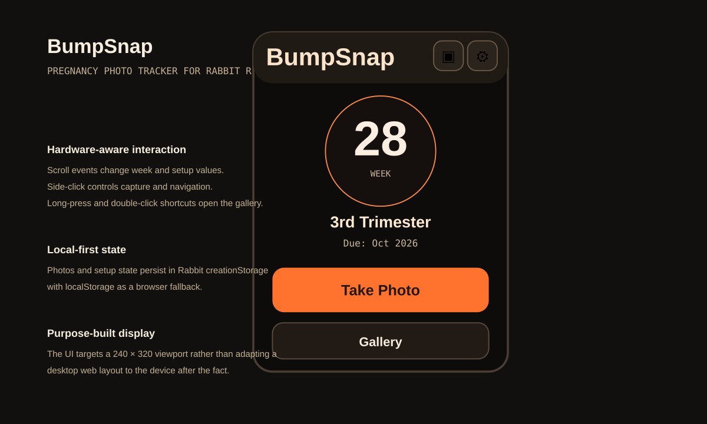

# BumpSnap

A pregnancy photo tracker built specifically for the Rabbit r1. The application uses the device's compact display and hardware events to make weekly photo capture possible without treating the r1 as a small generic browser.



> The image above is a static interface preview derived from the current 240 × 320 application source.

<!--
Runtime screenshot gallery. Capture requirements are documented in docs/screenshots/README.md.
Replace the static preview above with 01-home.png once the runtime set is ready, then place the remaining images beside the sections they support.


-->

## What it does

BumpSnap tracks pregnancy progress by week and stores a sequence of bump photos against that timeline. The current application supports setup, weekly photo capture, a gallery, photo detail views, a timed slideshow, reminders and a post-birth state.

The interaction model is designed around the r1 hardware:

- scroll events change setup values, pregnancy week and scrollable content
- a side click confirms setup steps and controls capture or navigation depending on the active screen
- a double side click from the home screen opens the gallery
- a long press from home also opens the gallery
- the camera screen uses `getUserMedia` when available and falls back to an image input

## Implementation

The application is intentionally small and dependency-light. It uses Vite for development and plain browser JavaScript for state, navigation and device interaction.

`apps/app/src/main.js` contains the state machine and event handling. The state model records the due date, current week, saved photos, setup completion and birth state.

Persistence uses two stores. On the r1, the application waits for `creationStorage.plain`, then stores an encoded state object. Browser `localStorage` is maintained as a fallback and recovery path. The loader also accepts earlier storage formats so existing state can be normalised rather than discarded.

The UI is defined for a 240 × 320 viewport. `apps/app/src/style.css` uses a compact dark interface with high-contrast capture actions and fixed layouts sized for the device rather than a responsive desktop-first design.

## Reminder behaviour

Once setup is complete, the application checks whether the current pregnancy week has a stored photo. If the weekly photo is missing it can:

- display a non-blocking reminder banner
- play a short Web Audio notification
- trigger vibration where the browser supports it

The reminder remains non-blocking so hardware navigation still works.

## Run locally

```bash
cd apps/app
npm install
npm run dev
```

Build with:

```bash
npm run build
```

For local browser testing, the space bar is mapped to the r1 side-click event when the device plugin handler is not present.

## Project structure

```text
apps/app/
├── index.html          # device UI and application screens
├── src/main.js         # state, capture, reminders and r1 events
├── src/style.css       # 240 × 320 interface styling
└── vite.config.js

metadata/               # Rabbit creation metadata and QR artefacts
scripts/                # helper scripts for creation packaging
```

## Current limitations

BumpSnap stores photos locally with the application state. It does not currently provide cloud backup, account sync or multi-device recovery.

Camera behaviour also depends on the capabilities exposed by the host browser or r1 runtime. The code includes browser fallbacks, but the hardware interaction path is the primary target.